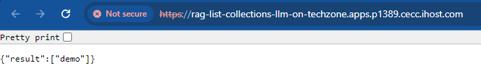

# Hands-on Lab: RAG on IBM Power with Sales Manual PDFs

When I did the original lab, we did get it to work, but I was left feeling a little rushed. OK, I had an LLM and RAG running on IBM Power, but what bits did what? Why did I do some of those steps?

So, I set about splitting the work apart, so I could go step by step. And I also wanted to look at a question I get asked a lot, which needs IBM Power specialists like me to go dig into the big documents called Sales Manuals. Could I move the focus of the LLM from Harry Potter to address my work questions, such as "How many processors go into that IBM Power server?"

I therefore have a number of containers here, which are intended to be deployed into the same OCP Project as we used for the earler work. So, we still have the LLM in the Llama CPP Server we used before, and we make use of the Milvus DB we also deployed in the earlier steps.

## 0 Warning!

In the "app.py" files in this section, I have at the moment got hardcoded URLs, which will need to be changes to match the Techzone environment you are using. I hope to change that in the future!

You therefore need to change the URL in this line to match your environment, where "pXXXX" is the environment you are using:

CORS(app, origins=["https://rag-webpage-llm-on-techzone.apps.pXXXX.cecc.ihost.com"]) 

We can work with the Llama CPP Server and Milvus Servers using the connections internal to OCP, so those don't need to be changed, but I could not get the CORS process to work with those internal addresses, as it failed to resolve them.

If you fork your own version of the Git respository, that will allow you to make the changes to the URLs that work for you.

## 1 Deploy the RAG List Collections container

Use the "+Add" option from the lefthand menu to add our first container in this section, importing from Git

Point OCP at this respository, which I forked from Marvin's orginal work, so put "https://github.com/DSpurway/RAG-with-Notebook" as the URL for the Git Repo. But, don't deploy yet, as we need to go a bit deeper, and work with some of the "advanced Git options"

Click "Show advanced Git options". Put "/Part2-RAG-Sales-Manual/RAG-List-Collections" into the "Context dir", and OCP should work out you want to use a Dockerfile. 

I put these containers into a new app, to show them grouped together. So, choose "Create application" in the "Application" pull down menu, then name our app "Sales Manual RAG App". We can use that for the rest of the containers we will deploy. 
Change the name of this deployment to "rag-list-collections" and hit "Create". I am leaving the creation of the route as default, as that allows testing and is also used by the webpage we shall build later. I hope to move to using internal OCP routes in the future, to avoid the issue above!

When that container has deployed, we can hit the small icon on the top right of the container icon to open the URL and test the container is working as intended. You are likely to have to accept the security warnings, then, the collections should be listed, which would include "demo" from our ealier work if that is still in place.

## 2 Deploy the RAG Drop Collections container

With that container deployed and the app created, we can move on to add more. Use the three dots (also called a hamburger) and "Add to application", from Git as we did before. Remember to change the URL on Git so the name resolution works on your environment. 

Again, put "https://github.com/DSpurway/RAG-with-Notebook" as the URL for the Git Repo and open the advanced options. We might want to drop elements from our Vector DB, so put "/Part2-RAG-Sales-Manual/RAG-Drop-Collection" as the context directory to deploy that container. Change the name to "rag-drop-collection" and "Create".

## 3 Deploy the RAG Loader container

Now, we need something load our Sales Manual documents into the Vector DB, so we can repeat the steps above for RAG-Loader. At this point, I have used static versions of the Sales Manual documents for our IBM Power servers based on Power10, pulled down from the Documentation website. As they are not the online versions yet (as I have not worked out how to get through the dynamic HTML that is presently used to access those documents online), changes we announce and make to the Sales Manuals will cause these versions to get out of date. You might therefore want to pull down new copies and put them into Git, if needed. Also, remember to change the URL as before. Put "/Part2-RAG-Sales-Manual/RAG-Loader" in the context directory and name this "rag-loader". 

## 4 Deploy the RAG Get Docs container

As we have a way to load our Sales Manuals into the Vector DB, we will next want to pull back the "chunks" from the documents so we can use them in our prompt to the LLM. Part of the loading process automatically inclused the source document in the metadata that is stored in the Vector DB, so we can get chunks of text back which we know come from the appropriate Sales Manual, and not get mixed up results. Also, we can keep Harry Potter out of this too!

Change the URL before you deploy, then repeat the steps we used before with "/Part2-RAG-Sales-Manual/RAG-Get-Docs" as the context directory and "rag-get-docs" as the name. 

## 5 Deploy the RAG Prompt LLM container

This container is something of a workaround, as it would probably be better if my webpage actually did this step, but I had issues with something called CORS which stopped me doing that. So this container passes the prompt we build over the the LLM. And, as that usually times out on the webpage, we can also come to logs in the pods for this container to actually see the end result! Change the URL as before, then use "/Part2-RAG-Sales-Manual/RAG-Prompt-LLM" as the context directory and "rag-prompt-llm" as the name. 

## 6 Deploy the RAG Webpage container

To pull these all together, I have build a little webpage (which looks less than ideal, but does the job for the moment!). Here, the "app.py" is very basic and does not need changing, but you will have to track down quite a few instances for hardcoded URL to change in the "index.html" file! Sorry about that! You will see I have functions that call out to the containers we just build, so we need to change the URLs in these functions:
- 
