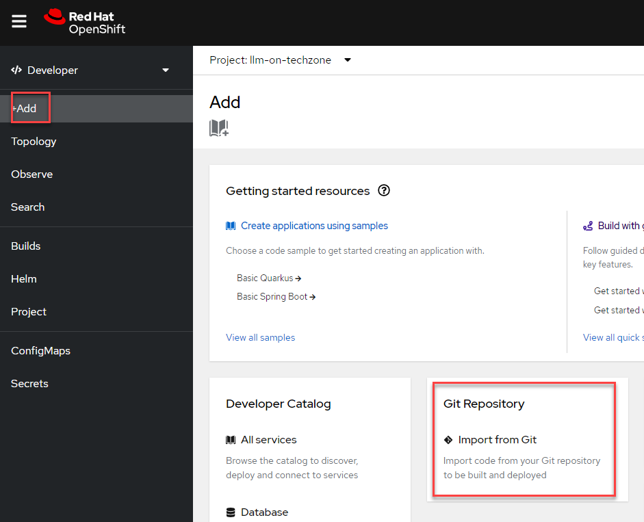
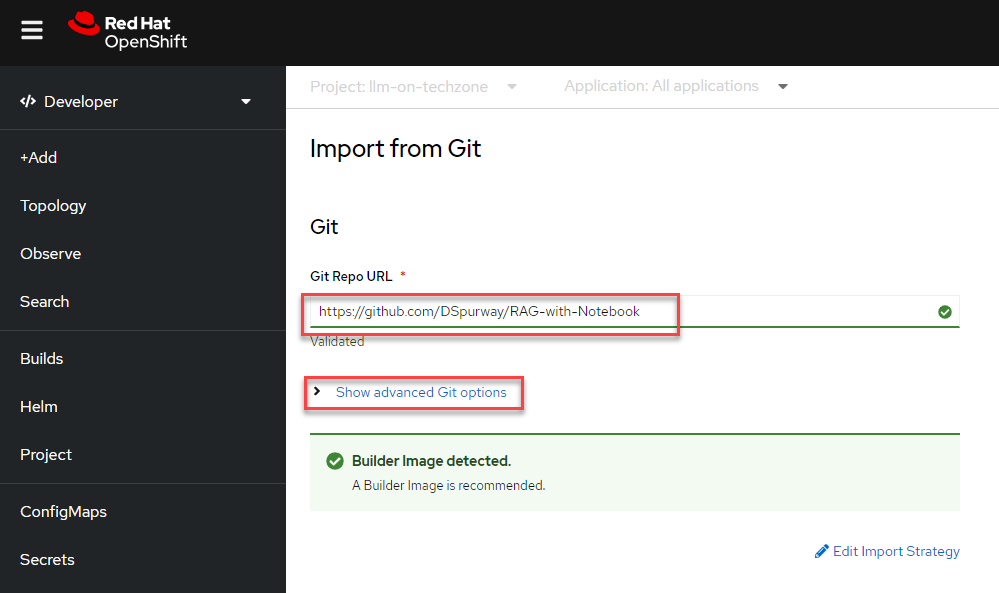
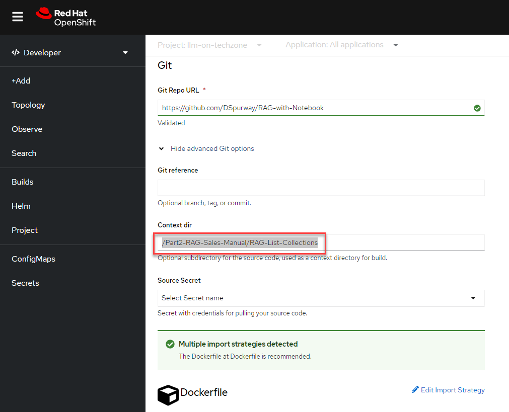

# Hands-on Lab: RAG on IBM Power with Sales Manual PDFs

When I did the original lab, we did get it to work, but I was left feeling a little rushed. OK, I had an LLM and RAG running on IBM Power, but what bits did what? Why did I do some of those steps?

So, I set about splitting the work apart, so I could go step by step. And I also wanted to look at a question I get asked a lot, which needs IBM Power specialists like me to go dig into the big documents called Sales Manuals. Could I move the focus of the LLM from Harry Potter to address my work questions, such as "How many processors go into that IBM Power server?"

I therefore have a number of containers here, which are intended to be deployed into the same OCP Project as we used for the earler work. So, we still have the LLM in the Llama CPP Server we used before, and we make use of the Milvus DB we also deployed in the earlier steps.

## 0 Warning!

In the "app.py" files in this section, I have at the moment got hardcoded URLs, which will need to be changes to match the Techzone environment you are using. I hope to change that in the future!

You therefore need to change the URL in this line to match your environment, where "pXXXX" is the environment you are using:

CORS(app, origins=["https://rag-webpage-llm-on-techzone.apps.pXXXX.cecc.ihost.com"]) 

We can work with the Llama CPP Server and Milvus Servers using the connections internal to OCP, so those don't need to be changed, but I could not get the CORS process to work with those internal addresses, as it failed to resolve them.

## 1 Deploy the RAG List Collections container

Use the "+Add" option from the lefthand menu to add our first container in this section, importing from Git

Point OCP at this respository, which I forked from Marvin's orginal work, so put "https://github.com/DSpurway/RAG-with-Notebook" as the URL for the Git Repo. But, don't deploy yet, as we need to go a bit deeper, and work with some of the "advanced Git options"

Click "Show advanced Git options". Put "/Part2-RAG-Sales-Manual/RAG-List-Collections" into the "Context dir", and OCP should work out you want to use a Dockerfile. 

I put these containers into a new app, to show them grouped together. So, choose "Create application" in the "Application" pull down menu, then name our app "Sales Manual RAG App". We can use that for the rest of the containers we will deploy. 
Change the name of this deployment to "rag-list-collections" and hit "Create". I am leaving the creation of the route as default, as that allows testing and is also used by the webpage we shall build later. I hope to move to using internal OCP routes in the future, to avoid the issue above!

