# Hands-on Lab: RAG on IBM Power with Sales Manual PDFs

When I did the original lab, we did get it to work, but I was left feeling a little rushed. OK, I had an LLM and RAG running on IBM Power, but what bits did what? Why did I do some of those steps?

So, I set about splitting the work apart, so I could go step by step. And I also wanted to look at a question I get asked a lot, which needs IBM Power specialists like me to go dig into the big documents called Sales Manuals. Could I move the focus of the LLM from Harry Potter to address my work questions, such as "How many processors go into that IBM Power server?"

I therefore have a number of containers here, which are intended to be deployed into the same OCP Project as we used for the earler work. So, we still have the LLM in the Llama CPP Server we used before, and we make use of the Milvus DB we also deployed in the earlier steps.

## 0 Warning!

In the "app.py" files in this section, I have at the moment got hardcoded URLs, which will need to be changes to match the Techzone environment you are using. I hope to change that in the future!

You therefore need to change the URL in this line to match your environment, where "pXXXX" is the environment you are using:

CORS(app, origins=["https://rag-webpage-llm-on-techzone.apps.pXXXX.cecc.ihost.com"]) 

We can work with the Llama CPP Server and Milvus Servers using the connections internal to OCP, so those don't need to be changed, but I could not get the CORS process to work with those internal addresses, as it failed to resolve them.

If you fork your own version of the Git respository, that will allow you to make the changes to the URLs that work for you.

## 1 Deploy the RAG List Collections container

Use the "+Add" option from the lefthand menu to add our first container in this section, importing from Git

Point OCP at this respository, which I forked from Marvin's orginal work, so put "https://github.com/DSpurway/RAG-with-Notebook" as the URL for the Git Repo. But, don't deploy yet, as we need to go a bit deeper, and work with some of the "advanced Git options"

Click "Show advanced Git options". Put "/Part2-RAG-Sales-Manual/RAG-List-Collections" into the "Context dir", and OCP should work out you want to use a Dockerfile. 

I put these containers into a new app, to show them grouped together. So, choose "Create application" in the "Application" pull down menu, then name our app "Sales Manual RAG App". We can use that for the rest of the containers we will deploy. 
Change the name of this deployment to "rag-list-collections" and hit "Create". I am leaving the creation of the route as default, as that allows testing and is also used by the webpage we shall build later. I hope to move to using internal OCP routes in the future, to avoid the issue above!

When that container has deployed, we can hit the small icon on the top right of the container icon to open the URL and test the container is working as intended. You are likely to have to accept the security warnings, then, the collections should be listed, which would include "demo" from our ealier work if that is still in place.

## 2 Deploy the RAG Drop Collections container

With that container deployed and the app created, we can move on to add more. Use the three dots (also called a hamburger) and "Add to application", from Git as we did before. Remember to change the URL on Git so the name resolution works on your environment. 

Again, put "https://github.com/DSpurway/RAG-with-Notebook" as the URL for the Git Repo and open the advanced options. We might want to drop elements from our Vector DB, so put "/Part2-RAG-Sales-Manual/RAG-Drop-Collection" as the context directory to deploy that container. Change the name to "rag-drop-collection" and "Create".

## 3 Deploy the RAG Loader container

Now, we need something load our Sales Manual documents into the Vector DB, so we can repeat the steps above for RAG-Loader. At this point, I have used static versions of the Sales Manual documents for our IBM Power servers based on Power10, pulled down from the Documentation website. As they are not the online versions yet (as I have not worked out how to get through the dynamic HTML that is presently used to access those documents online), changes we announce and make to the Sales Manuals will cause these versions to get out of date. You might therefore want to pull down new copies and put them into Git, if needed. Also, remember to change the URL as before. Put "/Part2-RAG-Sales-Manual/RAG-Loader" in the context directory and name this "rag-loader". 

## 4 Deploy the RAG Get Docs container

As we have a way to load our Sales Manuals into the Vector DB, we will next want to pull back the "chunks" from the documents so we can use them in our prompt to the LLM. Part of the loading process automatically inclused the source document in the metadata that is stored in the Vector DB, so we can get chunks of text back which we know come from the appropriate Sales Manual, and not get mixed up results. Also, we can keep Harry Potter out of this too!

Change the URL before you deploy, then repeat the steps we used before with "/Part2-RAG-Sales-Manual/RAG-Get-Docs" as the context directory and "rag-get-docs" as the name. 

## 5 Deploy the RAG Prompt LLM container

This container is something of a workaround, as it would probably be better if my webpage actually did this step, but I had issues with something called CORS which stopped me doing that. So this container passes the prompt we build over the the LLM. And, as that usually times out on the webpage, we can also come to logs in the pods for this container to actually see the end result! Change the URL as before, then use "/Part2-RAG-Sales-Manual/RAG-Prompt-LLM" as the context directory and "rag-prompt-llm" as the name. 

## 6 Deploy the RAG Webpage container

To pull these all together, I have build a little webpage (which looks less than ideal, but does the job for the moment!). Here, the "app.py" is very basic and does not need changing, but you will have to track down quite a few instances for hardcoded URL to change in the "index.html" file! Sorry about that! You will see I have functions that call out to the containers we just build, so we need to change the URLs (there is one in each) in these five functions:

- myRAG_list_collections_func
- myRAG_drop_collections_func
- myRAG_loader_func
- myRAG_get_docs_func
- myRAG_send_prompt_func

Then we can deploy, using "/Part2-RAG-Sales-Manual/RAG-Webpage" as the context directory and "rag-webpage" as the name. 

You will probably end up with a level of overlap between our applications on the OCP console, so you can drag the application group to a clear space. I also then moved around my deployed containers, as the webpage is at the top and calls the rest. Purely to illistrate how things link together, I use the arrow that appears if you hover over a container to draw arrows from the "rag-webpage" to the other containers. And then from the "rag-prompt-llm" to the original "llama-cpp-server" we had before. 

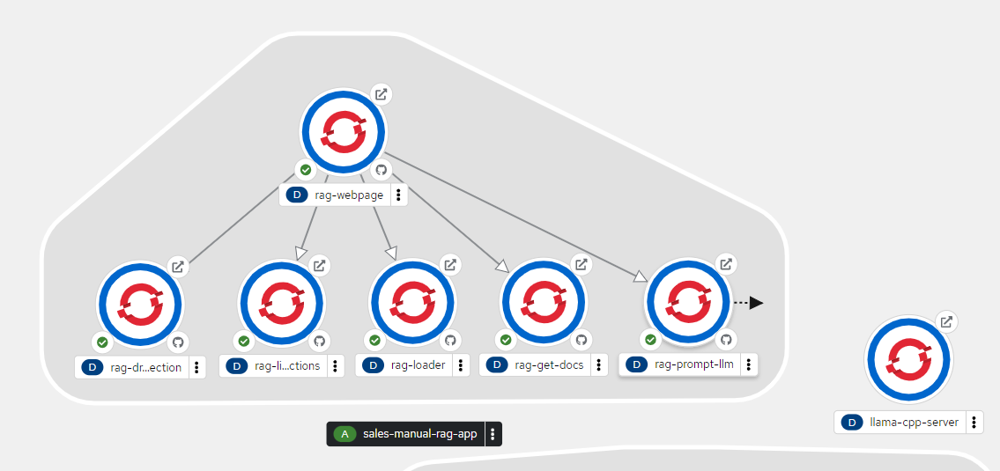

## 7 Using the RAG Webpage

Open up the URL for our webpage with the small icon as we did earlier with our little test

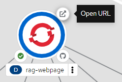

The first time you do this, you hit this security warning, so click "Advanced" and then "Proceed to..." to get passed that. Trust me!

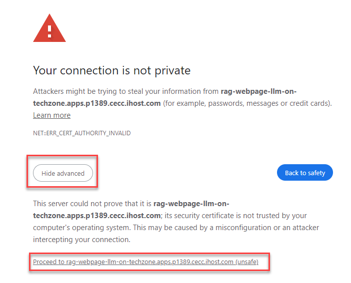

That should then get to my little webpage. You may notice I left on that Watson Code Assistant was helpful to me doing this work. I am not a developer, and so Python, HTML and JavaScript are all a challenge for me. WCA was therefore useful!

If you click the "Click to List Collections for RAG" button (I have aimed for labels that hopefully are clear on the buttons!), you should see "demo" returned, from the earlier work with Harry Potter. That is the Collection that container the Harry Potter book. 

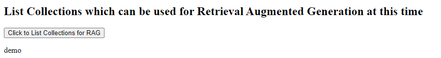

While the existance of that collection actually should not change anything for our Sales Manual work, as we will only call on documents from given sources, you still might like to clean up and drop that collection. You may find that the "Enter a collection above then click to drop that collection" may initially not work. If you go behind the scenes and "Inspect" the webpage, you may see that the page hit a "404" error, which it is actually caused by the "ERR_CERT_AUTHORITY_INVALID" error. That comes from the same security issue we had to get passed to open the webpage. So, if you open up the URLs for our containers manually yourself once, to get passed that warning and proceed, that should sort that issue...

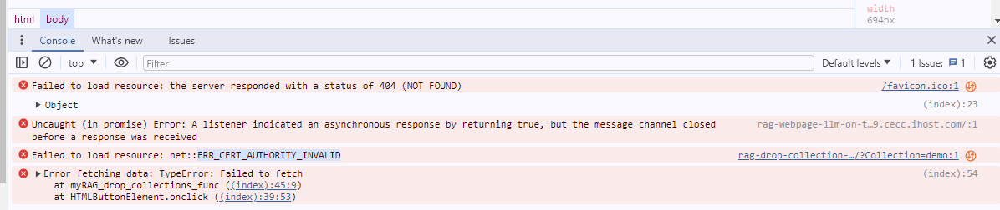

When it works, you should see this: 

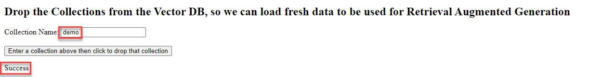

Repressing the list collections button now does not return anything, as there are no collections in the Vector DB.

So, on to adding some data! As mentioned, I am not a developer, so this next part is not really ideal. The Sales Manual for the S1012 is quite small, relative to the others, so that button might work as intended. As the button says after you have pressed it, it can take a while to load the Sales Manual into the Vector DB. The larger Sales Manual files are likely to timeout, which is unfortunate. But, we can check the logs on the actual pod in the container, and check it actually does work. On the OCP console, click on our "rag-loader" container to open it up. In "Resources" in the panel that appears, we can see the Pods (or pod, in this case!) for our container. Click on the "View logs" by the Pods to see what has actually happened.

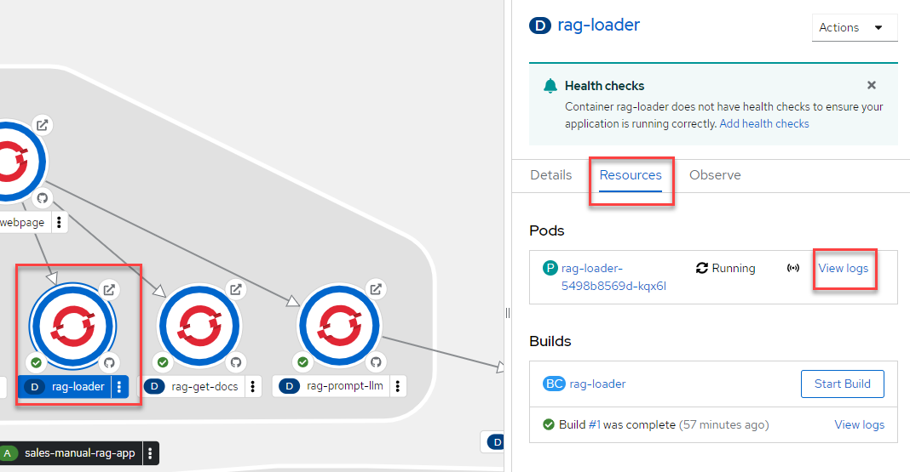

In the log, as the last entry down the bottom, you should see that we did get passed the Server Name, connected to the Milvus host, loaded the file, split it into quite a few chunks, got the embeddings and completed the vector store. So, while the webpage does not look good, it does work!

Repeat for the other Sales Manual files, checking the logs on the Pod to allow each to complete before starting the next load. It takes a bit of time, but not too bad!

Now that that is done, repeating a click of the list collections button should show you we now have a new collection, "sales_manuals".

We are now set to actually do some AI on our data, but we have already been using GenAI to load our data into the Vector DB, as the embedding step is using AI to work out how to label our data as it goes into the Vector DB, so we can pull it back usefully.

Pick your server from the pull down list, and click the button, to bring back 3 chunks of data which may help answer our "question". 

This is quite fast, so we should be able to see the results on the webpage after only a short wait. 
How do those chunks look? This is the data we shall include in our prompt that goes to the LLM. If desired, change the Question that is used at that retrival stage, and the chunks returned will be different. (You may need to refresh the page to clear our the old data, if desired).

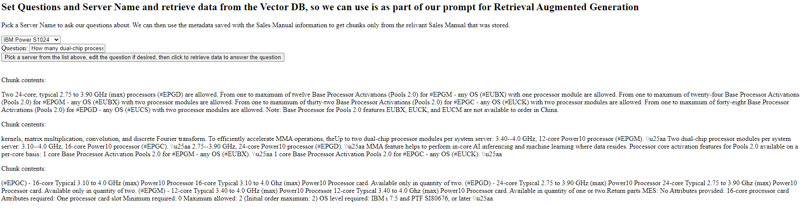

Clicking the "Edit the prompt if desired, then click to set the prompt" does what it suggests, and builds our prompt to go to the LLM. RAG is just fancy prompting (I am using Christoffer Jensen's words there, as I now see what he means!), so we can refine what we are about to send until we are happy with it. This is prompt engineering.

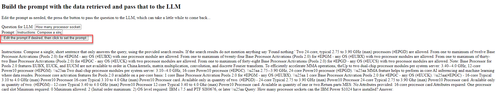

Now, for the last step, which sadly is another part that takes longer than the webpage allows. We are doing this on our Techzone environment, and one element that can have a strong impact on the performance of LLMs on IBM Power is whether you can ensure all the cores being used are on the same Power10 socket. With Techzone, we don't get that control, so we can't ensure that is the case. And we only get a limited amount of resources. So, what we are showing here is what can be done, and proving it works on IBM Power, but it is not showing the performance that can be achieved with a system you have more control over. So, don't be put off by the performance! You can check the logs to see what if happening, if you click on the "rag-prompt-llm" container, and look to the log for the pod again. 

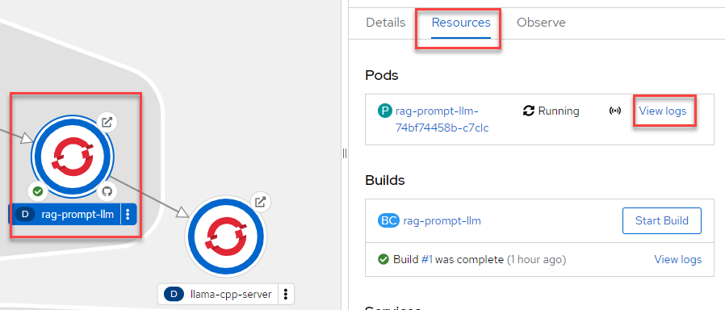

Looking in the logs, we can see the prompt we sent, and that it is then sent off to the LLM, to see what comes back. And, at the end of the day, we do get our answer back! 

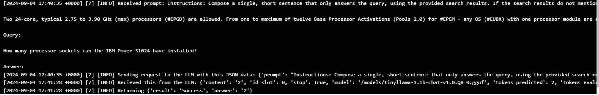

How did it do? If the answer is not what you were after, we can go back, refine the prompt, and try again.

## The Future

Hopefully breaking things down like this has helped you see what happens at the different stages, and that we can do all this on IBM Power, with only a small amount of resource. I am only using a small LLM here, which impacts the accuracy of the answers, and so we can change that up in the future. And, hopefully, we can find a way to avoid the timeouts we presently hit! So, I'll keep working at this, and see what can be done. Let me know if you have comments or suggestions, as those would be most welcome! 

## The Next Steps

This is just a quick demo, which you can run up fast, and show to your customers. IBMers and BPs have access to Techzone, so we can reserve the needed environment, and show it to customers. Please do that! Then, we can work with IBM Client Engineering to run workshops like the Use Case Alignment workshop, to see how AI can help them. See what we can do together!
